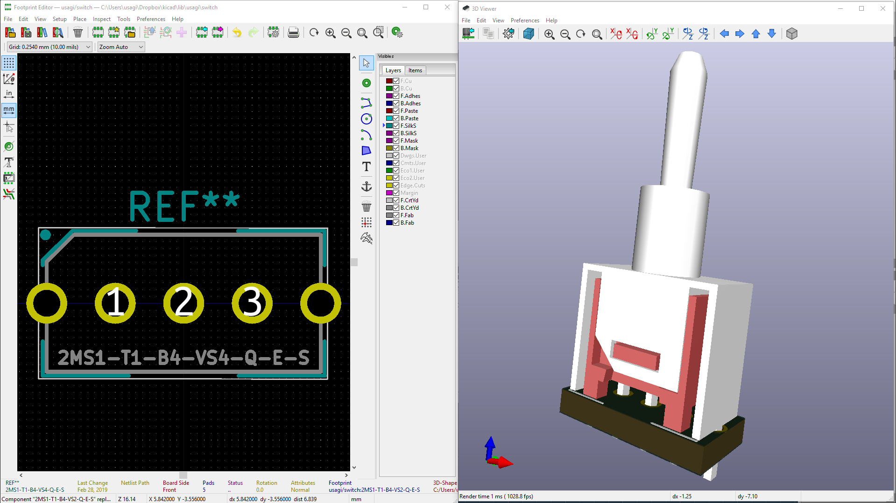
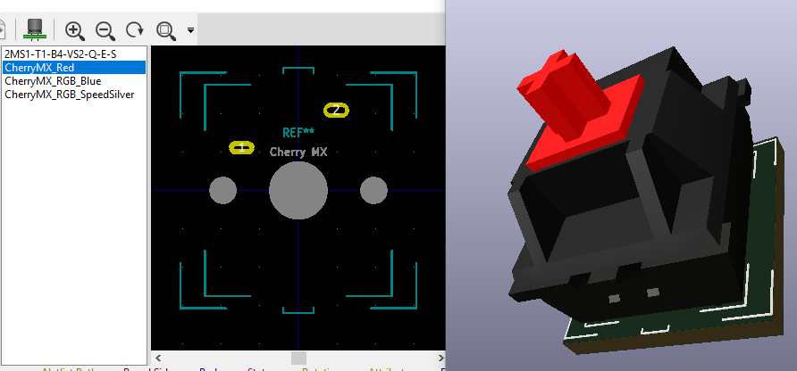
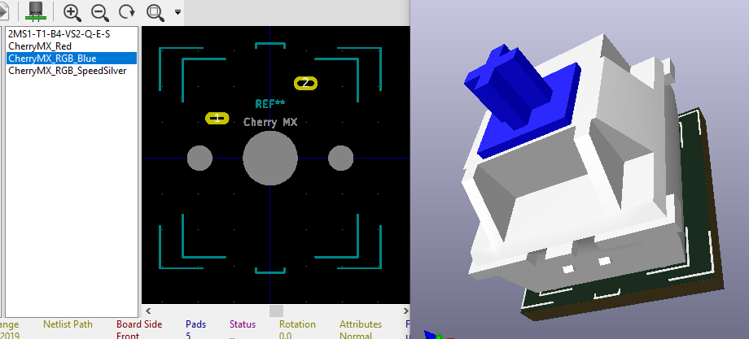
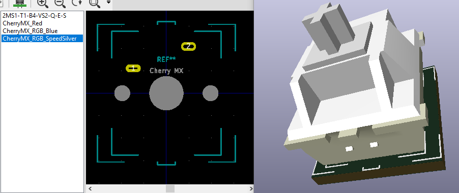
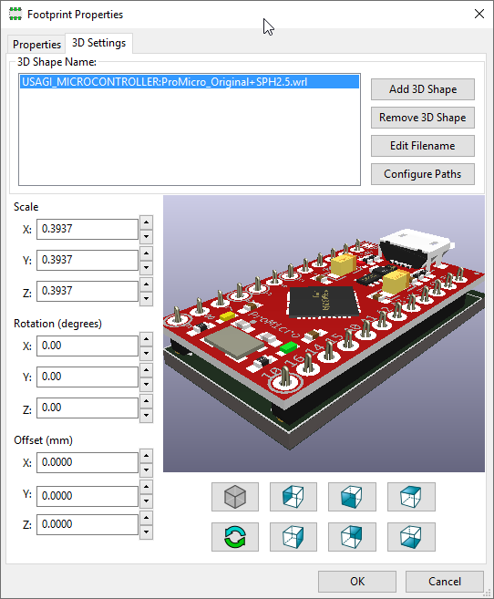
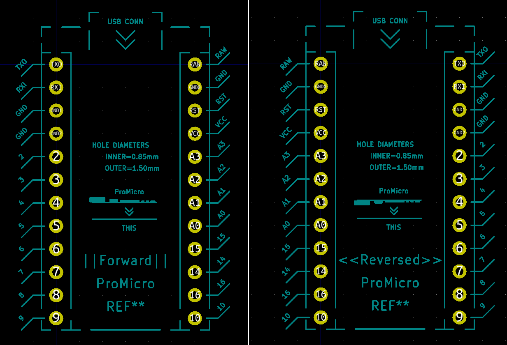
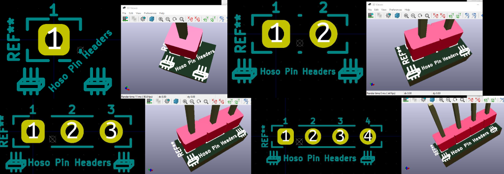
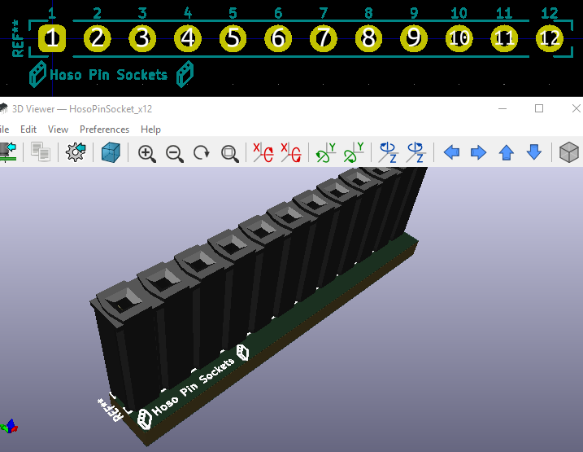
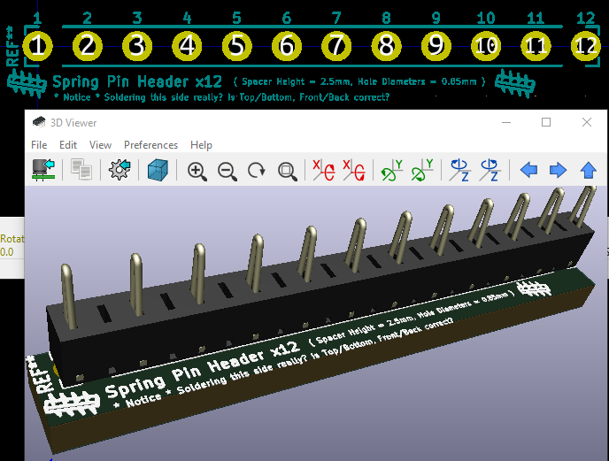

# usagi.kicad

自作キーボードを作り始めた Usagi Ito の KiCad ライブラリー。

いちばんお世話になっている 
[秋月電子通商](http://akizukidenshi.com/) 
で買える部品を中心に、わたしが自作キーボードに必用、
または気まぐれに kawaii から KiCad でも表示したいと思った何かが追加されてゆくのだと思います。

## こんせぷと

- ちょっと重くても 3Dモデル がそれっぽく乗ってかっこいい！（🐰サン脳内基準）
- 「まちがわないくろ」のように実装者がシルクを見たら「ワカった😃」気がしそうなフットプリント（ワカルとは言ってない）

…なお🐰サンの気分次第で変わります。 Git だし MIT なのでオキニのバージョンでどうぞ♥

# いめーじ

# 使い方

- .kicad_mod の配置場所を KiCad のフットプリントライブラリーに追加し、
- .wrl の配置場所を KiCad の3Dモデルのパスに追加してください。
    - .kicad_mod では `model :USAGI_MICROCONTROLLER:ProMicro_Original+SPH2.5.wrl` のように .wrl を設定した状態になっています。
    - 必用に応じて KiCad のエイリアスを設定するか .kicad_mod から .wrl へのパスを変更してよしなにしてください。
    - デフォルトのエイリアスは `USAGI_CONN`, `USAGI_MICROCONTROLLER`, `USAGI_SWITC` のように `USAGI_{それぞれの入っているディレクトリー名を大文字にした文字列` になっています。

…と、いう説明でよくわからない方、できない方は KiCad の使い方がわからない状態だと思うので、
とりあえずググるなどして自己解決されてくださいませ💁

# License

- [MIT](LICENSE.md)

# Author

- [Usagi Ito](http://github.com/usagi)
    - Tw: [@USAGI_WRP](https://twitter.com/USAGI_WRP)
    - Fb: [usagi.wrp](https://www.facebook.com/usagi.wrp)
