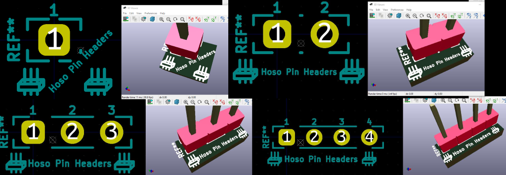
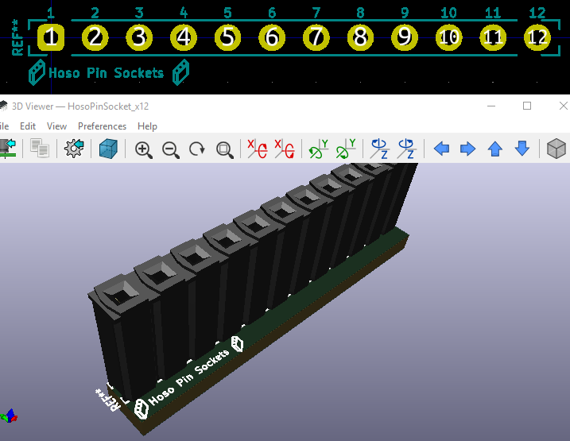
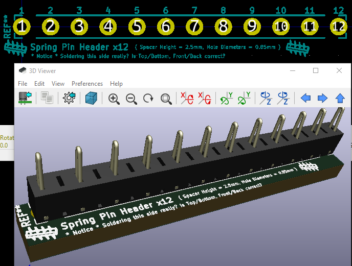

# CONN

## HosoPinHeader 系

秋月電子通商の「細ピンヘッダー」に対応するピンヘッダー用。ふつうのピンソケじゃなくて1.27mmピッチ用のピンを2.54mmピッチ用のスペーサーにぶちこんだやつ。ProMicroの穴とかブレッドボードの穴にさっくりと挿せる。

- `PHA-1x40SG-{A}` @ `C-0663{B}`
    - `{A} = [ BK, GY, WH, RD, YL, GN, BU, PP ]`
    - `{B} = [ 1, 2, 3, 4, 5, 6, 7, 9 ]`
- <http://akizukidenshi.com/catalog/g/gC-06641/>

`.kicad_mod` ではわたしが好きな赤色の `.wrl` を設定していますが、製品の存在する各色（黒、灰、白、赤、黄、緑、青、紫）の `.wrl` は一部用意があるのでお好みに応じて使ってください。

## HosoPinSocket 系

秋月電子通商の「細ピンソケット」に対応するピンソケット用。ふつうのピンソケじゃなくて1.27mmピッチ用のピンを2.54mmピッチ用のスペーサーにぶちこんだやつ。ProMicroの穴とかブレッドボードの穴に相当する。

- `FHU-1x40SGN5-B` @ `C-10073`
- <http://akizukidenshi.com/catalog/g/gC-10073/>

ざんねんながらソケット側はカラーバリエーションが無いみたいなので黒だけで我慢しましょう…。高さも 8.5mm しか無いみたいなので我慢しましょう…。ピン側と違ってソケット側は内部構造がちょっと複雑（↑秋月電子通商のデータシート参照）なので単純に切ってもうまく使えません。諦めましょう…。

## MAC8-XB-3-?-12P 系

スプリングピンヘッダー、コンスルーと呼ばれているやつ。はんだ付け要らずで、むにゅりと穴に挿すと導通してくれる便利な子。スペーサーの高さも1mmから10mmまで柔軟で薄くキレイに基板を重ねる設計に使いやすい。

但し、抜き挿し50回、はんだ付けする側はどっちにすべきか、左右に並べる場合はどう向きを揃えるべきかなどあんがい細かい仕様（推奨事項）があるちょっとややこしい子。ふつうのピンに比べるとちと高いなど便利さと癖を兼ね備えている。

- `XB-3-{A}`
    - `{A} = 1, 1.5, 2, 2.5, 3, 3.5, 4, 4.5, 5, 5.5, 6, 7, 8, 9, 10`
- <https://www.mac8sdk.co.jp/products/217>

# いめーじ

