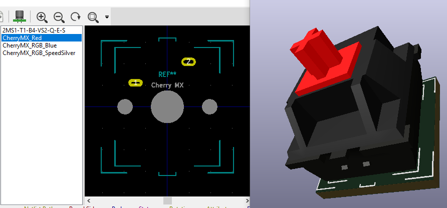
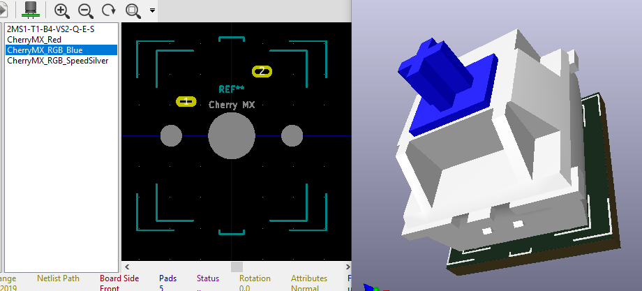
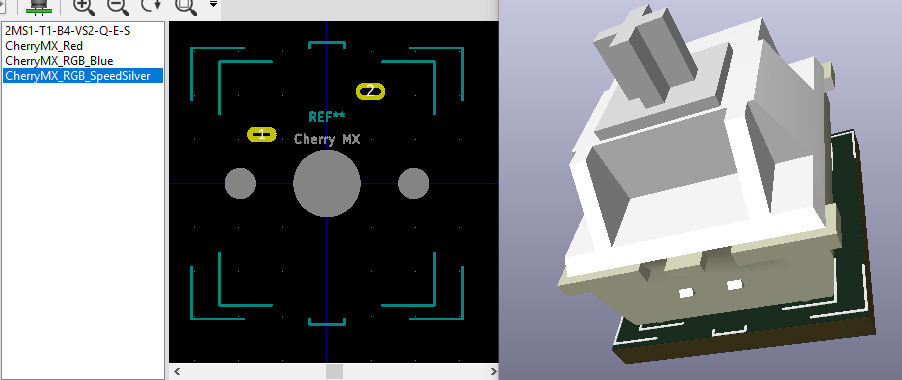

# いめーじ

## 基板実装用トグルスイッチ

- [2MS1-T1-B4-VS2-Q-E-S](http://akizukidenshi.com/catalog/g/gP-00300/)

## Cherry MX

- MX Blue と MX Speed Silver の実測値と MX のカタログスペックから当たり判定に大事そうな外形を再現した3Dデータです。
- 端子のホールは実測値に +0.2mm のマージンを加え、パッドはホール +0.65mm を設定してあります。

